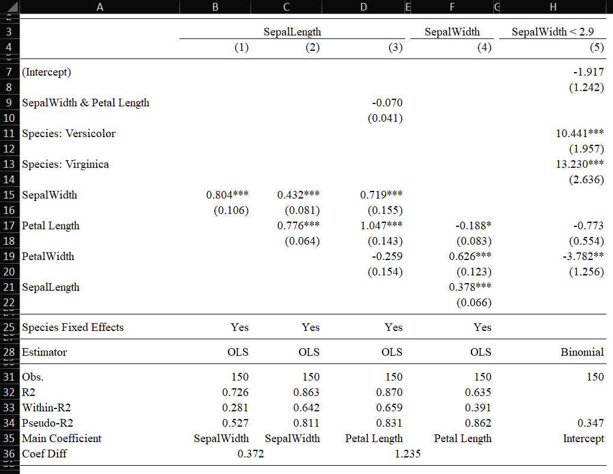

# RegressionTablesXLSX.jl

This package is an extension of [RegressionTables.jl](https://github.com/jmboehm/RegressionTables.jl) that adds functionality to export a `RegressionTable` to the .xlsx format. This package reexports RegressionTables.jl, so using this package alone is an option. See the main package for the majority of the documentation.

There are two main reasons this package is a separate package:
1. It relies on Python (and the [openpyxl](https://openpyxl.readthedocs.io/en/stable/)) package, so to prevent unnecessary installation of python, this package is separate.
2. Many of the underlying functions are quite different from the main RegressionTables package since writing to Excel is fundamentally different than writing out plain text.

## Installation

This package is not yet registered in the Julia registry, so installation is through the main link:

```julia
] add "https://github.com/junder873/RegressionTablesXLSX.jl.git"
```

## Usage

Simply specify the render as `XlsxTable()` and provide a file to export to XLSX:

```julia
regtable(rr1, rr2, rr3; render=XlsxTable(), file="data.xlsx")
```

If you want to output the table to a specific tab, pass the file as a tuple:

```julia
regtable(rr1, rr2, rr3; render=XlsxTable(), file=("data.xlsx", "first table"))
```

## Example

```julia
using RegressionTablesXLSX, DataFrames, RDatasets, FixedEffectModels, GLM;
df = dataset("datasets", "iris");
rr1 = reg(df, @formula(SepalLength ~ SepalWidth + fe(Species)))
rr2 = reg(df, @formula(SepalLength ~ SepalWidth + PetalLength + fe(Species)))
rr3 = reg(df, @formula(SepalLength ~ SepalWidth * PetalLength + PetalWidth + fe(Species)))
rr4 = reg(df, @formula(SepalWidth ~ SepalLength + PetalLength + PetalWidth + fe(Species)))
rr5 = glm(@formula(SepalWidth < 2.9 ~ PetalLength + PetalWidth + Species), df, Binomial())

regtable(
    rr1,rr2,rr3,rr4,rr5;
    render = XlsxTable(),
    file = "regression.xlsx",
    labels = Dict(
        "versicolor" => "Versicolor",
        "virginica" => "Virginica",
        "PetalLength" => "Petal Length",
    ),
    regression_statistics = [
        Nobs => "Obs.",
        R2,
        R2Within,
        PseudoR2 => "Pseudo-R2",
    ],
    extralines = [
        ["Main Coefficient", "SepalWidth", "SepalWidth", "Petal Length", "Petal Length", "Intercept"],
        DataRow(["Coef Diff", 0.372 => 2:3, 1.235 => 3:4, ""], align="lccr")
    ],
    order = [r"Int", r" & ", r": "]
)
```



## Notes

The `XlsxTable` is actually a subtype of the `AbstractAscii` types from the RegressionTables package. Therefore, editing the defaults for `AbstractAscii` will likewise change the results in the `XlsxTable` output (see [Customization and Defaults](https://jmboehm.github.io/RegressionTables.jl/stable/customization/) for more information).

This package also tries to export numbers as real numbers with a custom format in XLSX. Therefore, the information stored is not just the 3 (or how ever many you selected) digits, but the full number, allowing for easy one off adjustments.